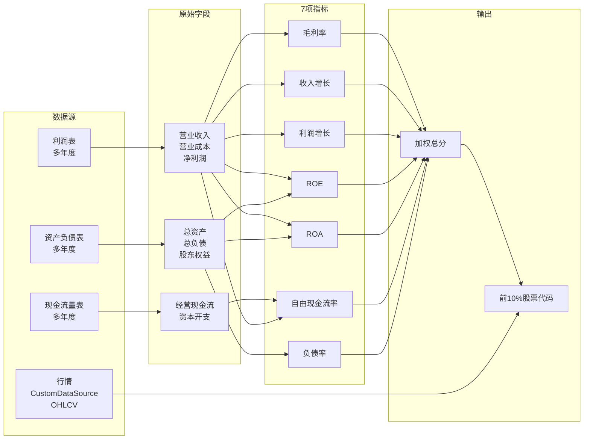
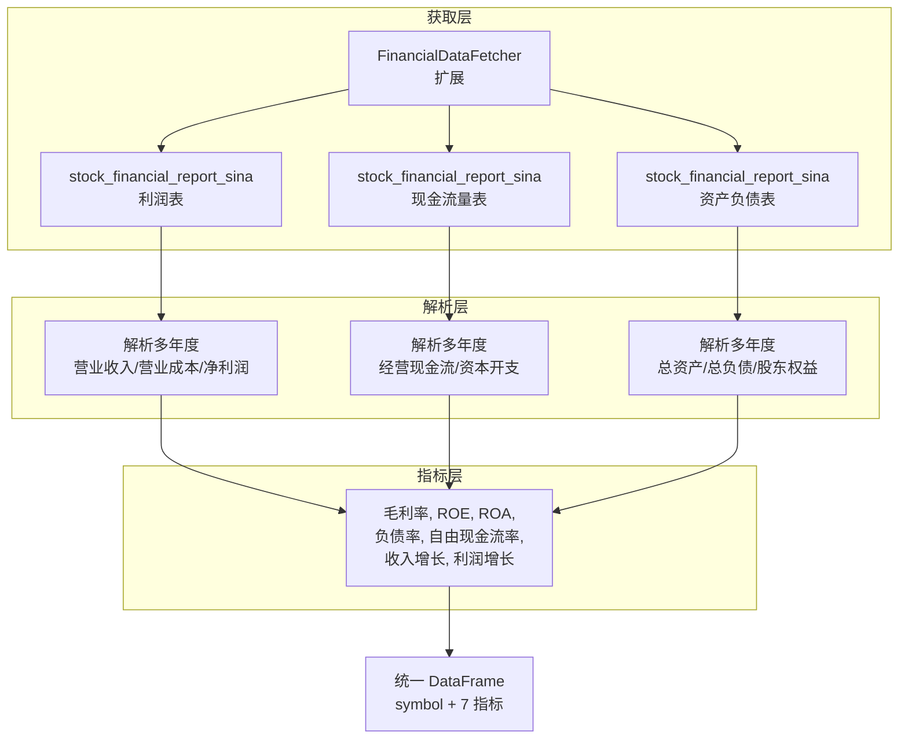
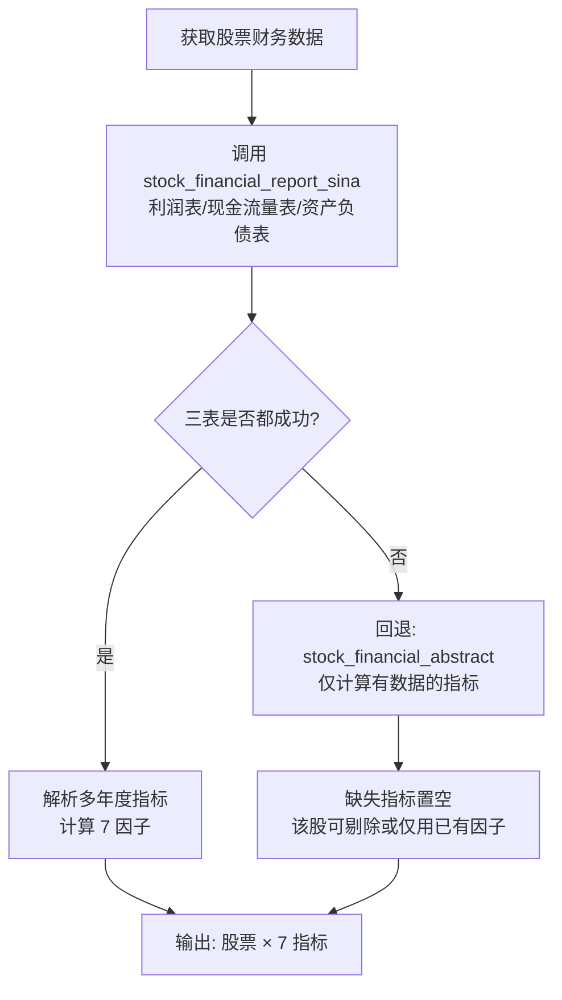

# 完整财务数据获取方案（质量成长 7 因子）

用于 **factor_growth_indicator** 的 7 项指标与权重：

| 指标       | 权重  |
| ---------- | ----- |
| ROE        | 20%   |
| 自由现金流率 | 20%   |
| 收入增长   | 15%   |
| 利润增长   | 15%   |
| 毛利率     | 10%   |
| ROA        | 10%   |
| 负债率     | 10%   |

---

## 一、数据流总览（图表）

**说明**：行情用于回测与择时；财务三表（多年度）用于计算 7 项指标 → 加权总分 → 筛选前 10%。

---

## 二、7 项指标与所需原始字段

| 指标         | 计算公式                     | 所需原始字段（利润表/现金流量表/资产负债表） |
| ------------ | ---------------------------- | -------------------------------------------- |
| **ROE**      | 净利润 / 股东权益            | 净利润、股东权益（净资产）                   |
| **自由现金流率** | 自由现金流 / 营业收入（或净利润） | 经营现金流、资本开支、营业收入               |
| **收入增长** | 营业收入 5 年 CAGR          | 营业收入（近 5 年年报）                      |
| **利润增长** | 净利润 5 年 CAGR            | 净利润（近 5 年年报）                        |
| **毛利率**   | (营业收入 - 营业成本) / 营业收入 | 营业收入、营业成本                           |
| **ROA**      | 净利润 / 总资产              | 净利润、总资产                               |
| **负债率**   | 总负债 / 总资产              | 总负债、总资产                               |

**多年度要求**：收入增长、利润增长需至少 **5 年**（或 3 年）年报数据；ROE/ROA/毛利率/负债率/自由现金流率可用 **最近一期年报** 或多年均值。

---

## 三、数据源对比与推荐

### 3.1 方案对比表

| 数据源 | 类型 | 利润表 | 现金流量表 | 资产负债表 | 多年度 | 稳定性 | 备注 |
|--------|------|--------|------------|------------|--------|--------|------|
| **AKShare 新浪三表** | 免费 | ✅ 单接口多年度 | ✅ 单接口多年度 | ✅ 单接口多年度 | ✅ 一次取齐多列多年 | 高（新浪财经） | **推荐**，需解析“指标”行 |
| **AKShare 财务摘要** | 免费 | 摘要指标 | 摘要指标 | 摘要指标 | ⚠️ 多列多期需解析 | 中 | 当前 `financial_fetcher` 所用，缺营业成本/资本开支 |
| **TuShare Pro** | 需积分 | ✅ income | ✅ cashflow | ✅ balancesheet | ✅ 按 ts_code+期 | 高 | 需 2000+ 积分，字段最规范 |
| **东方财富 业绩报表** | 免费 | 部分 | - | - | 按报告期 | 中 | 适合营收/净利润，缺完整三表 |
| **咕咕数据 API** | 付费 | ✅ | ✅ | ✅ | ✅ | 高 | 商业化接口 |

### 3.2 推荐方案：**AKShare 新浪三表（优先） + 回退**

- **优先**：使用 **`ak.stock_financial_report_sina(stock=code, symbol=报表类型)`**
  - `symbol` 取 `"利润表"`、`"现金流量表"`、`"资产负债表"` 各调一次。
  - 返回格式：**行 = 报告期**（多年度），**列 = 报表日期、单位、各指标**，一次拿到该股票该表的所有年度。
  - **稳定性**：数据来自新浪财经，AKShare 维护较活跃，免费无 token。

- **字段映射建议**（根据新浪报表常见指标名）：
  - 利润表：营业收入、营业成本、净利润、利润总额、所得税费用等。
  - 现金流量表：经营活动产生的现金流量净额、购建固定资产等支付的现金（作资本开支）等。
  - 资产负债表：总资产、总负债、股东权益合计（或净资产）等。

- **回退**：若新浪接口失败或某只股票无数据，可回退到现有 **stock_financial_abstract**，仅计算有数据的指标（如 ROE、ROA、负债率、收入/利润若摘要中有多期则可算增长），自由现金流率、毛利率在缺项时置空并剔除该标的或仅用已有因子。

### 3.3 数据源架构图

---

## 四、实现要点（供开发用）

1. **扩展 `FinancialDataFetcher`（或新建 `FinancialReportFetcher`）**
   - 新增方法：`get_three_sheets_multi_year(code, years=5)`。
   - 内部调用 3 次 `ak.stock_financial_report_sina(stock=code, symbol="利润表|现金流量表|资产负债表")`。
   - 解析返回的 DataFrame：行为指标名，列为报告期（如 20231231、20221231…），提取所需行并转为数值，按报告期整理成“长表”或“宽表”。

2. **指标计算**
   - 毛利率、ROE、ROA、负债率：用**最近一期年报**（或指定报告期）。
   - 自由现金流率：`(经营现金流 - 资本开支) / 营业收入`（或 / 净利润），缺资本开支时用 0 或置空。
   - 收入增长、利润增长：用**近 5 年年报**（或 3 年）算 CAGR；不足 5 年则用已有年数或置空。

3. **与行情“同一数据源”**
   - 行情仍用 **create_custom_data_source()**（不变）。
   - 财务部分在策略/选股前单独调用上述财务获取层，得到“股票 × 7 指标”表，再与股票池取交集，只对既有行情又有完整 7 因子的股票算总分并排序取前 10%。

4. **权重与筛选**
   - 按您给的 7 项权重：ROE 20%、自由现金流率 20%、收入增长 15%、利润增长 15%、毛利率 10%、ROA 10%、负债率 10%。
   - 对 7 项做**截面 Z-score 标准化**（负债率为负向，标准化后取负），加权求和得总分，排序后取 **前 10% 股票代码**。

---

## 五、小结

| 项目     | 建议 |
|----------|------|
| **完整财务数据来源** | 优先 **AKShare 新浪三表** `stock_financial_report_sina`，一次取多年度利润表、现金流量表、资产负债表。 |
| **稳定性** | 新浪源 + 免费，AKShare 维护较好；可加本地/Redis 缓存减少重复请求。 |
| **图表** | 上文 Mermaid：数据流总览 + 数据源/解析/指标三层架构。 |
| **实现顺序** | 先实现“获取完整三表多年度 → 解析 → 7 指标”，再接入现有因子策略做“行情 + 财务”与前 10% 筛选。 |

若需要，我可以下一步在仓库里实现：  
1）基于 `stock_financial_report_sina` 的三表获取与解析；  
2）7 指标计算与权重评分；  
3）与 `factor_growth_indicator.py` 的衔接（仅用上述 7 因子 + 前 10%）。

---

## 六、数据源优先级（获取时顺序）

**说明**：新浪三表返回格式为 **行 = 报告期、列 = 报表日期/单位/各指标**，解析时按列名匹配“营业收入”“净利润”“经营现金流”等即可。
